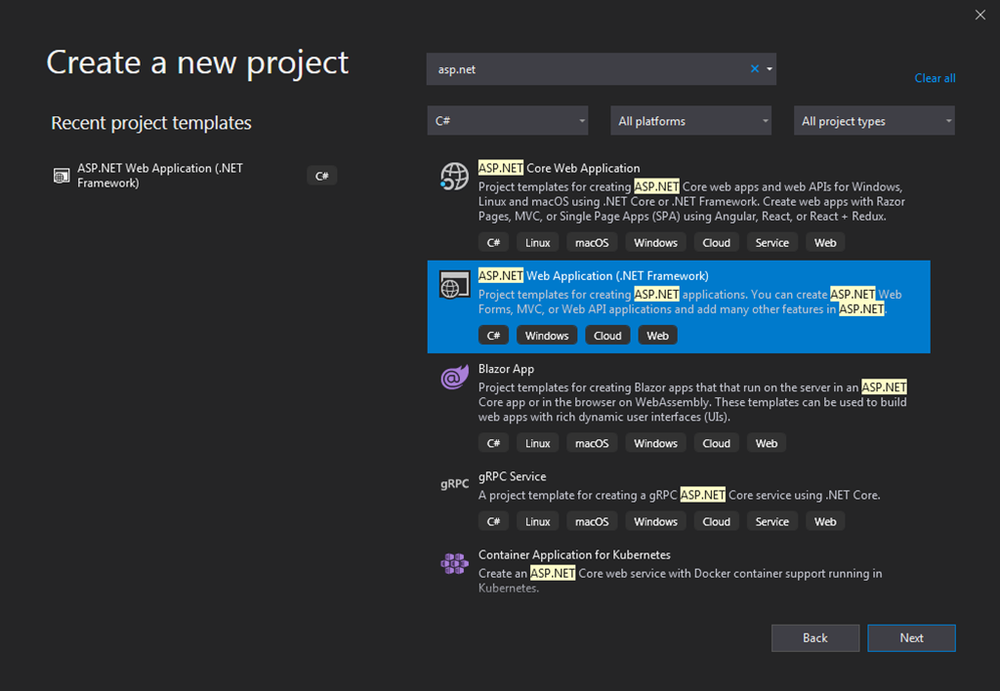
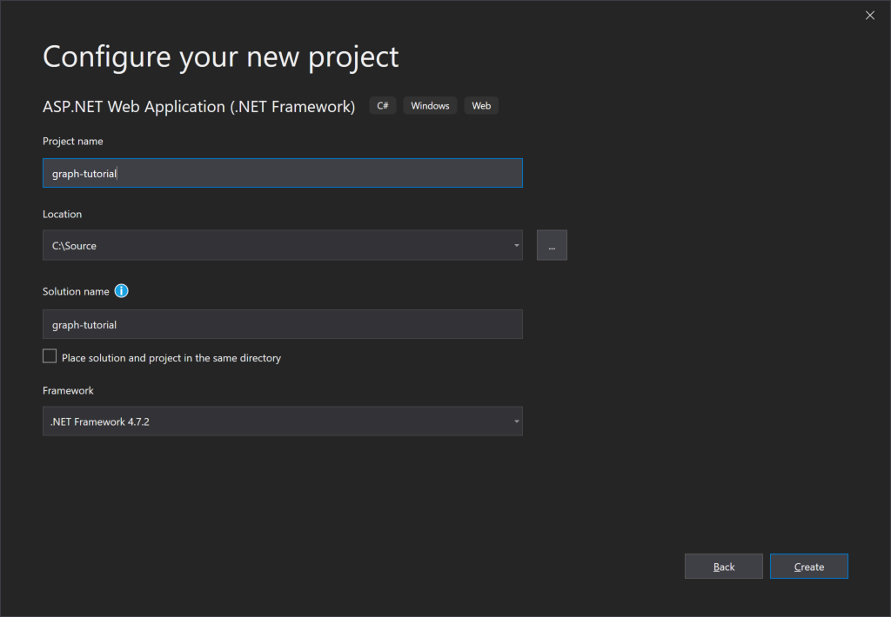
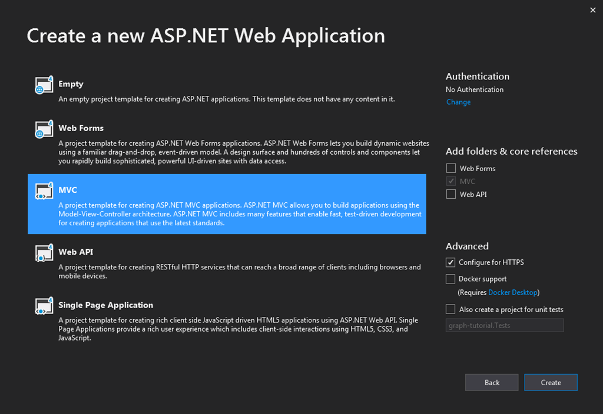

<!-- markdownlint-disable MD002 MD041 -->

<span data-ttu-id="575e5-101">Commencez par créer un projet MVC ASP.NET.</span><span class="sxs-lookup"><span data-stu-id="575e5-101">Start by creating an ASP.NET MVC project.</span></span>

1. <span data-ttu-id="575e5-102">Ouvrez Visual Studio, puis sélectionnez **créer un nouveau projet**.</span><span class="sxs-lookup"><span data-stu-id="575e5-102">Open Visual Studio, and select **Create a new project**.</span></span>

1. <span data-ttu-id="575e5-103">Dans la boîte de dialogue **créer un nouveau projet** , choisissez l’option **application Web ASP.net (.NET Framework)** qui utilise C#, puis sélectionnez **suivant**.</span><span class="sxs-lookup"><span data-stu-id="575e5-103">In the **Create new project** dialog, choose the **ASP.NET Web Application (.NET Framework)** option that uses C#, then select **Next**.</span></span>

    

1. <span data-ttu-id="575e5-105">Entrez `graph-tutorial` dans le champ **nom du projet** , puis sélectionnez **créer**.</span><span class="sxs-lookup"><span data-stu-id="575e5-105">Enter `graph-tutorial` in the **Project name** field and select **Create**.</span></span>

    

    > [!NOTE]
    > <span data-ttu-id="575e5-107">Assurez-vous d’entrer exactement le même nom pour le projet Visual Studio spécifié dans ces instructions d’atelier.</span><span class="sxs-lookup"><span data-stu-id="575e5-107">Ensure that you enter the exact same name for the Visual Studio Project that is specified in these lab instructions.</span></span> <span data-ttu-id="575e5-108">Le nom du projet Visual Studio devient partie intégrante de l’espace de noms dans le code.</span><span class="sxs-lookup"><span data-stu-id="575e5-108">The Visual Studio Project name becomes part of the namespace in the code.</span></span> <span data-ttu-id="575e5-109">Le code à l’intérieur de ces instructions dépend de l’espace de noms correspondant au nom de projet Visual Studio spécifié dans ces instructions.</span><span class="sxs-lookup"><span data-stu-id="575e5-109">The code inside these instructions depends on the namespace matching the Visual Studio Project name specified in these instructions.</span></span> <span data-ttu-id="575e5-110">Si vous utilisez un nom de projet différent, le code n’est pas compilé, sauf si vous ajustez tous les espaces de noms pour qu’ils correspondent au nom de projet Visual Studio que vous entrez lors de la création du projet.</span><span class="sxs-lookup"><span data-stu-id="575e5-110">If you use a different project name the code will not compile unless you adjust all the namespaces to match the Visual Studio Project name you enter when you create the project.</span></span>

1. <span data-ttu-id="575e5-111">Choisissez **MVC** et sélectionnez **créer**.</span><span class="sxs-lookup"><span data-stu-id="575e5-111">Choose **MVC** and select **Create**.</span></span>

    

1. <span data-ttu-id="575e5-113">Appuyez sur **F5** ou sélectionnez **déboguer > démarrer le débogage**.</span><span class="sxs-lookup"><span data-stu-id="575e5-113">Press **F5** or select **Debug > Start Debugging**.</span></span> <span data-ttu-id="575e5-114">Si tout fonctionne, votre navigateur par défaut doit ouvrir et afficher une page ASP.NET par défaut.</span><span class="sxs-lookup"><span data-stu-id="575e5-114">If everything is working, your default browser should open and display a default ASP.NET page.</span></span>

## <a name="add-nuget-packages"></a><span data-ttu-id="575e5-115">Ajouter des packages NuGet</span><span class="sxs-lookup"><span data-stu-id="575e5-115">Add NuGet packages</span></span>

<span data-ttu-id="575e5-116">Avant de poursuivre, mettez à `bootstrap` jour le package NuGet et installez des packages NuGet supplémentaires que vous utiliserez plus tard.</span><span class="sxs-lookup"><span data-stu-id="575e5-116">Before moving on, update the `bootstrap` NuGet package, and install some additional NuGet packages that you will use later.</span></span>

- <span data-ttu-id="575e5-117">[Microsoft. Owin. Host. SystemWeb](https://www.nuget.org/packages/Microsoft.Owin.Host.SystemWeb/) pour activer les interfaces [Owin](http://owin.org/) dans l’application ASP.net.</span><span class="sxs-lookup"><span data-stu-id="575e5-117">[Microsoft.Owin.Host.SystemWeb](https://www.nuget.org/packages/Microsoft.Owin.Host.SystemWeb/) to enable the [OWIN](http://owin.org/) interfaces in the ASP.NET application.</span></span>
- <span data-ttu-id="575e5-118">[Microsoft. Owin. Security. OpenIdConnect](https://www.nuget.org/packages/Microsoft.Owin.Security.OpenIdConnect/) pour effectuer l’authentification OpenID Connect avec Azure.</span><span class="sxs-lookup"><span data-stu-id="575e5-118">[Microsoft.Owin.Security.OpenIdConnect](https://www.nuget.org/packages/Microsoft.Owin.Security.OpenIdConnect/) for doing OpenID Connect authentication with Azure.</span></span>
- <span data-ttu-id="575e5-119">[Microsoft. Owin. Security. Cookies](https://www.nuget.org/packages/Microsoft.Owin.Security.Cookies/) pour activer l’authentification basée sur les cookies.</span><span class="sxs-lookup"><span data-stu-id="575e5-119">[Microsoft.Owin.Security.Cookies](https://www.nuget.org/packages/Microsoft.Owin.Security.Cookies/) to enable cookie-based authentication.</span></span>
- <span data-ttu-id="575e5-120">[Microsoft. Identity. client](https://www.nuget.org/packages/Microsoft.Identity.Client/) pour la demande et la gestion des jetons d’accès.</span><span class="sxs-lookup"><span data-stu-id="575e5-120">[Microsoft.Identity.Client](https://www.nuget.org/packages/Microsoft.Identity.Client/) for requesting and managing access tokens.</span></span>
- <span data-ttu-id="575e5-121">[Microsoft. Graph](https://www.nuget.org/packages/Microsoft.Graph/) pour effectuer des appels à Microsoft Graph.</span><span class="sxs-lookup"><span data-stu-id="575e5-121">[Microsoft.Graph](https://www.nuget.org/packages/Microsoft.Graph/) for making calls to Microsoft Graph.</span></span>

1. <span data-ttu-id="575e5-122">Sélectionnez **outils > gestionnaire de package NuGet > console Gestionnaire de package**.</span><span class="sxs-lookup"><span data-stu-id="575e5-122">Select **Tools > NuGet Package Manager > Package Manager Console**.</span></span>
1. <span data-ttu-id="575e5-123">Dans la console Gestionnaire de package, entrez les commandes suivantes.</span><span class="sxs-lookup"><span data-stu-id="575e5-123">In the Package Manager Console, enter the following commands.</span></span>

    ```Powershell
    Update-Package bootstrap
    Install-Package Microsoft.Owin.Host.SystemWeb
    Install-Package Microsoft.Owin.Security.OpenIdConnect
    Install-Package Microsoft.Owin.Security.Cookies
    Install-Package Microsoft.Identity.Client -Version 4.7.1
    Install-Package Microsoft.Graph -Version 1.20.0
    ```

## <a name="design-the-app"></a><span data-ttu-id="575e5-124">Concevoir l’application</span><span class="sxs-lookup"><span data-stu-id="575e5-124">Design the app</span></span>

<span data-ttu-id="575e5-125">Dans cette section, vous allez créer la structure de base de l’application.</span><span class="sxs-lookup"><span data-stu-id="575e5-125">In this section you will create the basic structure of the application.</span></span>

1. <span data-ttu-id="575e5-126">Créer une classe de démarrage OWIN de base.</span><span class="sxs-lookup"><span data-stu-id="575e5-126">Create a basic OWIN startup class.</span></span> <span data-ttu-id="575e5-127">Cliquez avec le bouton `graph-tutorial` droit sur le dossier dans l’Explorateur de solutions et sélectionnez **Ajouter > nouvel élément**.</span><span class="sxs-lookup"><span data-stu-id="575e5-127">Right-click the `graph-tutorial` folder in Solution Explorer and select **Add > New Item**.</span></span> <span data-ttu-id="575e5-128">Choisissez le modèle de **classe de démarrage OWIN** , nommez le fichier `Startup.cs`, puis sélectionnez **Ajouter**.</span><span class="sxs-lookup"><span data-stu-id="575e5-128">Choose the **OWIN Startup Class** template, name the file `Startup.cs`, and select **Add**.</span></span>

1. <span data-ttu-id="575e5-129">Cliquez avec le bouton droit sur le dossier **Models** dans l’Explorateur de solutions et sélectionnez **Ajouter une > classe...**. Nommez la `Alert` classe et sélectionnez **Ajouter**.</span><span class="sxs-lookup"><span data-stu-id="575e5-129">Right-click the **Models** folder in Solution Explorer and select **Add > Class...**. Name the class `Alert` and select **Add**.</span></span> <span data-ttu-id="575e5-130">Remplacez tout le contenu de `Alert.cs` par le code suivant.</span><span class="sxs-lookup"><span data-stu-id="575e5-130">Replace the entire contents of `Alert.cs` with the following code.</span></span>

    ```cs
    namespace graph_tutorial.Models
    {
        // Used to flash error messages in the app's views.
        public class Alert
        {
            public const string AlertKey = "TempDataAlerts";
            public string Message { get; set; }
            public string Debug { get; set; }
        }
    }
    ```

1. <span data-ttu-id="575e5-131">Ouvrez le `./Views/Shared/_Layout.cshtml` fichier et remplacez l’intégralité de son contenu par le code suivant pour mettre à jour la disposition globale de l’application.</span><span class="sxs-lookup"><span data-stu-id="575e5-131">Open the `./Views/Shared/_Layout.cshtml` file, and replace its entire contents with the following code to update the global layout of the app.</span></span>

    ```html
    @{
        var alerts = TempData.ContainsKey(graph_tutorial.Models.Alert.AlertKey) ?
            (List<graph_tutorial.Models.Alert>)TempData[graph_tutorial.Models.Alert.AlertKey] :
            new List<graph_tutorial.Models.Alert>();
    }

    <!DOCTYPE html>
    <html>
    <head>
        <meta charset="utf-8" />
        <meta name="viewport" content="width=device-width, initial-scale=1.0">
        <title>ASP.NET Graph Tutorial</title>
        @Styles.Render("~/Content/css")
        @Scripts.Render("~/bundles/modernizr")

        <link rel="stylesheet" href="https://use.fontawesome.com/releases/v5.1.0/css/all.css"
              integrity="sha384-lKuwvrZot6UHsBSfcMvOkWwlCMgc0TaWr+30HWe3a4ltaBwTZhyTEggF5tJv8tbt"
              crossorigin="anonymous">
    </head>

    <body>
        <nav class="navbar navbar-expand-md navbar-dark fixed-top bg-dark">
            <div class="container">
                @Html.ActionLink("ASP.NET Graph Tutorial", "Index", "Home", new { area = "" }, new { @class = "navbar-brand" })
                <button class="navbar-toggler" type="button" data-toggle="collapse" data-target="#navbarCollapse"
                        aria-controls="navbarCollapse" aria-expanded="false" aria-label="Toggle navigation">
                    <span class="navbar-toggler-icon"></span>
                </button>
                <div class="collapse navbar-collapse" id="navbarCollapse">
                    <ul class="navbar-nav mr-auto">
                        <li class="nav-item">
                            @Html.ActionLink("Home", "Index", "Home", new { area = "" },
                                new { @class = ViewBag.Current == "Home" ? "nav-link active" : "nav-link" })
                        </li>
                        @if (Request.IsAuthenticated)
                        {
                            <li class="nav-item" data-turbolinks="false">
                                @Html.ActionLink("Calendar", "Index", "Calendar", new { area = "" },
                                    new { @class = ViewBag.Current == "Calendar" ? "nav-link active" : "nav-link" })
                            </li>
                        }
                    </ul>
                    <ul class="navbar-nav justify-content-end">
                        <li class="nav-item">
                            <a class="nav-link" href="https://developer.microsoft.com/graph/docs/concepts/overview" target="_blank">
                                <i class="fas fa-external-link-alt mr-1"></i>Docs
                            </a>
                        </li>
                        @if (Request.IsAuthenticated)
                        {
                            <li class="nav-item dropdown">
                                <a class="nav-link dropdown-toggle" data-toggle="dropdown" href="#" role="button" aria-haspopup="true" aria-expanded="false">
                                    @if (!string.IsNullOrEmpty(ViewBag.User.Avatar))
                                    {
                                        
                                    }
                                    else
                                    {
                                        <i class="far fa-user-circle fa-lg rounded-circle align-self-center mr-2" style="width: 32px;"></i>
                                    }
                                </a>
                                <div class="dropdown-menu dropdown-menu-right">
                                    <h5 class="dropdown-item-text mb-0">@ViewBag.User.DisplayName</h5>
                                    <p class="dropdown-item-text text-muted mb-0">@ViewBag.User.Email</p>
                                    <div class="dropdown-divider"></div>
                                    @Html.ActionLink("Sign Out", "SignOut", "Account", new { area = "" }, new { @class = "dropdown-item" })
                                </div>
                            </li>
                        }
                        else
                        {
                            <li class="nav-item">
                                @Html.ActionLink("Sign In", "SignIn", "Account", new { area = "" }, new { @class = "nav-link" })
                            </li>
                        }
                    </ul>
                </div>
            </div>
        </nav>
        <main role="main" class="container">
            @foreach (var alert in alerts)
            {
                <div class="alert alert-danger" role="alert">
                    <p class="mb-3">@alert.Message</p>
                    @if (!string.IsNullOrEmpty(alert.Debug))
                    {
                        <pre class="alert-pre border bg-light p-2"><code>@alert.Debug</code></pre>
                    }
                </div>
            }

            @RenderBody()
        </main>
        @Scripts.Render("~/bundles/jquery")
        @Scripts.Render("~/bundles/bootstrap")
        @RenderSection("scripts", required: false)
    </body>
    </html>
    ```

    > [!NOTE]
    > <span data-ttu-id="575e5-132">Ce code ajoute [bootstrap](https://getbootstrap.com/) pour les styles simples et [font Isard](https://fontawesome.com/) pour certaines icônes simples.</span><span class="sxs-lookup"><span data-stu-id="575e5-132">This code adds [Bootstrap](https://getbootstrap.com/) for simple styling, and [Font Awesome](https://fontawesome.com/) for some simple icons.</span></span> <span data-ttu-id="575e5-133">Il définit également une disposition globale avec une barre de navigation et utilise la `Alert` classe pour afficher les alertes.</span><span class="sxs-lookup"><span data-stu-id="575e5-133">It also defines a global layout with a nav bar, and uses the `Alert` class to display any alerts.</span></span>

1. <span data-ttu-id="575e5-134">Ouvrez `Content/Site.css` et remplacez l’intégralité de son contenu par le code suivant.</span><span class="sxs-lookup"><span data-stu-id="575e5-134">Open `Content/Site.css` and replace its entire contents with the following code.</span></span>

    ```css
    body {
      padding-top: 4.5rem;
    }

    .alert-pre {
      word-wrap: break-word;
      word-break: break-all;
      white-space: pre-wrap;
    }
    ```

1. <span data-ttu-id="575e5-135">Ouvrez le `Views/Home/index.cshtml` fichier et remplacez son contenu par ce qui suit.</span><span class="sxs-lookup"><span data-stu-id="575e5-135">Open the `Views/Home/index.cshtml` file and replace its contents with the following.</span></span>

    ```html
    @{
        ViewBag.Current = "Home";
    }

    <div class="jumbotron">
        <h1>ASP.NET Graph Tutorial</h1>
        <p class="lead">This sample app shows how to use the Microsoft Graph API to access Outlook and OneDrive data from ASP.NET</p>
        @if (Request.IsAuthenticated)
        {
            <h4>Welcome @ViewBag.User.DisplayName!</h4>
            <p>Use the navigation bar at the top of the page to get started.</p>
        }
        else
        {
            @Html.ActionLink("Click here to sign in", "SignIn", "Account", new { area = "" }, new { @class = "btn btn-primary btn-large" })
        }
    </div>
    ```

1. <span data-ttu-id="575e5-136">Cliquez avec le bouton droit sur le dossier **Controllers** dans l’Explorateur de solutions et sélectionnez **Ajouter un contrôleur de >...**. Sélectionnez **contrôleur MVC 5-vide** et sélectionnez **Ajouter**.</span><span class="sxs-lookup"><span data-stu-id="575e5-136">Right-click the **Controllers** folder in Solution Explorer and select **Add > Controller...**. Choose **MVC 5 Controller - Empty** and select **Add**.</span></span> <span data-ttu-id="575e5-137">Nommez le `BaseController` contrôleur et sélectionnez **Ajouter**.</span><span class="sxs-lookup"><span data-stu-id="575e5-137">Name the controller `BaseController` and select **Add**.</span></span> <span data-ttu-id="575e5-138">Remplacez le contenu de `BaseController.cs` par le code suivant.</span><span class="sxs-lookup"><span data-stu-id="575e5-138">Replace the contents of `BaseController.cs` with the following code.</span></span>

    ```cs
    using graph_tutorial.Models;
    using System.Collections.Generic;
    using System.Web.Mvc;

    namespace graph_tutorial.Controllers
    {
        public abstract class BaseController : Controller
        {
            protected void Flash(string message, string debug=null)
            {
                var alerts = TempData.ContainsKey(Alert.AlertKey) ?
                    (List<Alert>)TempData[Alert.AlertKey] :
                    new List<Alert>();

                alerts.Add(new Alert
                {
                    Message = message,
                    Debug = debug
                });

                TempData[Alert.AlertKey] = alerts;
            }
        }
    }
    ```

1. <span data-ttu-id="575e5-139">Ouvrez `Controllers/HomeController.cs` et modifiez la `public class HomeController : Controller` ligne comme suit :</span><span class="sxs-lookup"><span data-stu-id="575e5-139">Open `Controllers/HomeController.cs` and change the `public class HomeController : Controller` line to:</span></span>

    ```cs
    public class HomeController : BaseController
    ```

1. <span data-ttu-id="575e5-140">Enregistrez toutes vos modifications et redémarrez le serveur.</span><span class="sxs-lookup"><span data-stu-id="575e5-140">Save all of your changes and restart the server.</span></span> <span data-ttu-id="575e5-141">À présent, l’application doit être très différente.</span><span class="sxs-lookup"><span data-stu-id="575e5-141">Now, the app should look very different.</span></span>

    
