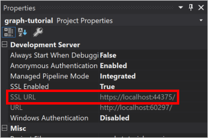
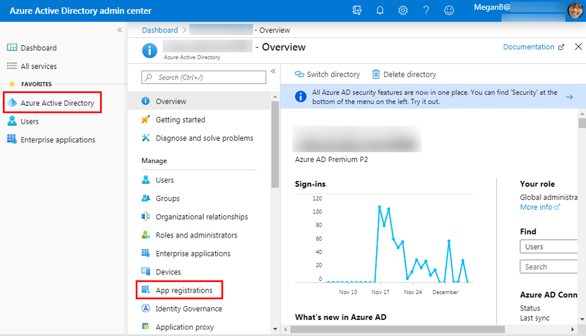
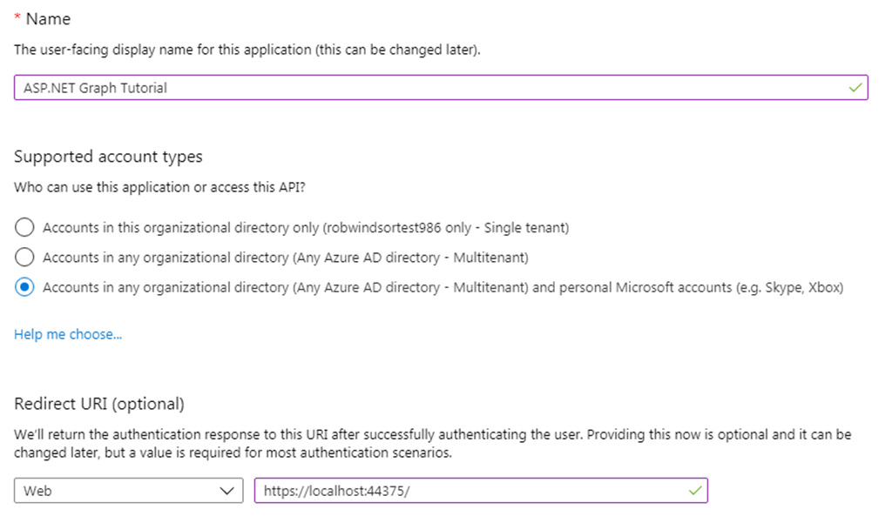
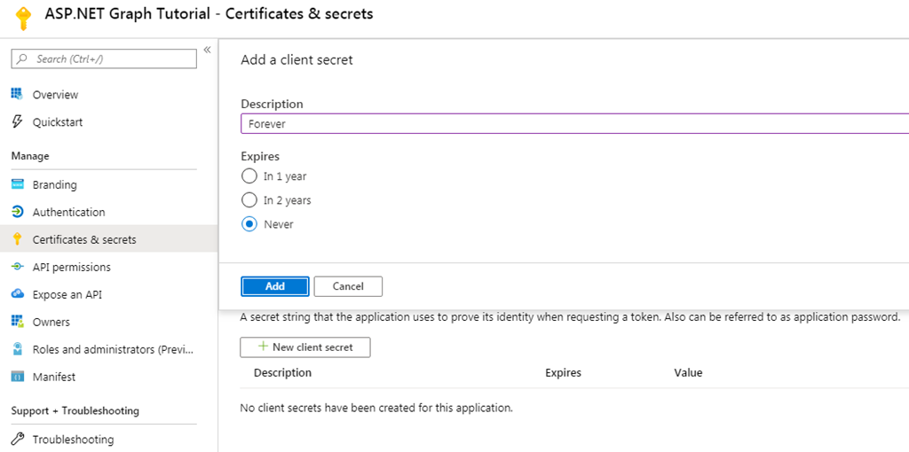

<!-- markdownlint-disable MD002 MD041 -->

Dans cet exercice, vous allez créer une inscription de l’application Web Azure AD à l’aide du centre d’administration Azure Active Directory.In this exercise, you will create a new Azure AD web application registration using the Azure Active Directory admin center.

1. Déterminez l’URL de votre application ASP.NET.Determine your ASP.NET app's URL. Dans l’Explorateur de solutions de Visual Studio, sélectionnez le projet du **didacticiel Graph** .In Visual Studio's Solution Explorer, select the **graph-tutorial** project. Dans la fenêtre **Propriétés**, trouvez la valeur de l’**URL**.In the **Properties** window, find the value of **URL**. Copiez cette valeur.Copy this value.

    

1. Ouvrez un navigateur et accédez au [Centre d’administration Azure Active Directory](https://aad.portal.azure.com).Open a browser and navigate to the [Azure Active Directory admin center](https://aad.portal.azure.com). Connectez-vous à l’aide d’un **compte personnel** (compte Microsoft) ou d’un **compte professionnel ou scolaire**.Login using a **personal account** (aka: Microsoft Account) or **Work or School Account**.

1. Sélectionnez **Azure Active Directory** dans le volet de navigation de gauche, puis sélectionnez **inscriptions des applications** sous **gérer**.Select **Azure Active Directory** in the left-hand navigation, then select **App registrations** under **Manage**.

    

1. Sélectionnez **Nouvelle inscription**.Select **New registration**. Sur la page **Inscrire une application**, définissez les valeurs comme suit.On the **Register an application** page, set the values as follows.

    - Définissez le **Nom** sur `ASP.NET Graph Tutorial`.Set **Name** to `ASP.NET Graph Tutorial`.
    - Définissez les **Types de comptes pris en charge** sur **Comptes dans un annuaire organisationnel et comptes personnels Microsoft**.Set **Supported account types** to **Accounts in any organizational directory and personal Microsoft accounts**.
    - Sous **URI de redirection**, définissez la première flèche déroulante sur `Web`, et la valeur sur l’URL d’application ASP.NET vous avez copiée à l’étape 1.Under **Redirect URI**, set the first drop-down to `Web` and set the value to the ASP.NET app URL you copied in step 1.

    

1. Choisissez **Inscrire**.Choose **Register**. Sur la page **ASP.net Graph Tutorial** , copiez la valeur de l' **ID d’application (client)** et enregistrez-la, vous en aurez besoin à l’étape suivante.On the **ASP.NET Graph Tutorial** page, copy the value of the **Application (client) ID** and save it, you will need it in the next step.

    

1. Sous **Gérer**, sélectionnez **Authentification**.Select **Authentication** under **Manage**. Recherchez la section **Octroi implicite**, puis activez **Jetons d’ID**.Locate the **Implicit grant** section and enable **ID tokens**. Choisissez **Enregistrer**.Choose **Save**.

    

1. Sélectionnez **Certificats et secrets** sous **Gérer**.Select **Certificates & secrets** under **Manage**. Sélectionnez le bouton **Nouveau secret client**.Select the **New client secret** button. Entrez une valeur dans **Description**, sélectionnez une des options pour **Expire le**, puis choisissez **Ajouter**.Enter a value in **Description** and select one of the options for **Expires** and choose **Add**.

    

1. Copiez la valeur du secret client avant de quitter cette page.Copy the client secret value before you leave this page. Vous en aurez besoin à l’étape suivante.You will need it in the next step.

    > [!IMPORTANT]
    > Ce secret client n’apparaîtra plus jamais, aussi veillez à le copier maintenant.This client secret is never shown again, so make sure you copy it now.

    